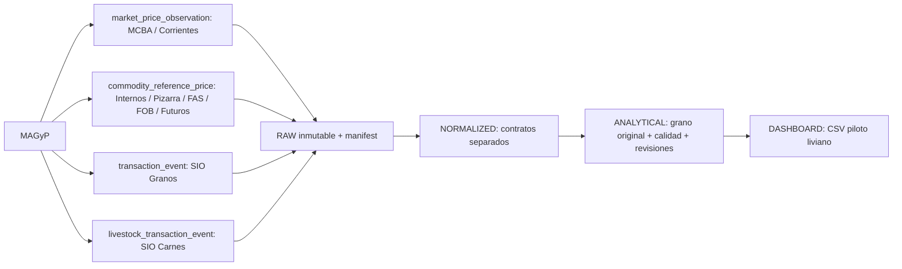

# Arquitectura canónica MAGyP — Serie Agrícola

Estado: piloto aislado MCBA, **COMPLEMENT_ONLY**. No reemplaza bases ni frontend.
Rama `codex/magyp-data-platform-mcba`, base main
`e18350e93d4aabf0f7ea46b92da98af69c40ab7d`. SIO avanzado queda pausado.



## Familias económicas

`market_price_observation`: cotización mayorista, dimensiones de producto, calidad,
procedencia, envase y mercado. MCBA es el único adaptador implementado aquí.
`commodity_reference_price`: referencia con plaza, tipo de precio, moneda/unidad,
posición, vencimiento/embarque; preservar cada proveedor/metodología como serie distinta.
`transaction_event`: evento SIO con ID oficial, contrato/operación, estado/tipo,
timestamp e historial de rectificaciones; snapshots no equivalen a eventos completos.
`livestock_transaction_event`: contrato reservado, dimensiones y metodología por validar.
Los tres últimos modelos están preparados documentalmente y por directorios, sin datos.

Registro: `config/magyp_sources.json`, nueve fuentes. Estados permitidos:
exploring, pilot, validated, production, fallback, deprecated. Ninguna fuente nueva
se declara production. No unir series por compartir producto/fecha.

## RAW

`data/magyp/raw/mcba/<capture_id>/response.xlsx` conserva bytes exactos del export.
`manifest.json` tiene fuente/familia/endpoint, método, parámetros públicos de fecha,
UTC, HTTP, content-type, encoding, tamaño, SHA-256, versiones, conteo y validación.
Además acquisition_mode, ID de captura y evidencia contextual de moneda/unidad.
En importación del export descargado por navegador, HTTP/content-type/método son
null porque no se observó el transporte final: no se inventa HTTP 200.
El evento de generación visto en UI es POST GeneXus DOEXPORT; no es API REST.
En --export-url, GET y status/content-type sí se observan; response_url registra
sólo URL pública XLSX sin query. Endpoint es el origen estable, no la sesión.
Parámetros date_from/date_to representan la ventana solicitada/validada del export;
no equivalen a un contrato REST de query. Fecha de captura = ingreso al repositorio;
en importación puede ser posterior a la descarga del navegador.

No guardar HTML del formulario: incluye GXState, firmas y tokens. No guardar HAR,
cookies, viewstate, eventvalidation, headers privados, request body de sesión ni logs
de excepciones con URLs secretas. Falla o respuesta HTML: no se incorpora como RAW
de precios; conservar sólo diagnóstico público sin cuerpo. Los RAW fallidos con
secretos no deben persistirse. Capturas creadas exclusivamente (mkdir + xb), jamás
actualizadas; cada revisión tiene otro ID. Si una escritura se interrumpe, una carpeta
incompleta debe investigarse y la normalización no debe admitirla.

RAW, NORMALIZED y ANALYTICAL permanecen **locales y excluidos de Git**. Son sólo cientos
de filas en este piloto, pero las bases históricas futuras requieren almacenamiento
durable externo/versionado antes de automatizar en Actions. No basta el filesystem
efímero del runner. Las salidas livianas piloto y reportes quedan disponibles para revisión.
No archivar el worktree antes de respaldar RAW; todo derivado se regenera desde esos bytes.

## MCBA: contrato verificado y límites

Origen [consulta oficial](https://ssma.magyp.gob.ar/frutas.precios.aspx).
Filtros visibles Desde/Hasta DD/MM/YYYY, IDs de controles
vDDO_FRUTAS_PRECIOS_FECHAAUXDATE y vDDO_FRUTAS_PRECIOS_FECHAAUXDATETO.
Estado interno date filters vTFFRUTAS_PRECIOS_FECHA/_TO, protocolo GeneXus.
Export XLSX: Fecha, Tipo, Especie, Variedad, Procedencia, Envase, Calidad, Tamaño,
Grado, Kg, Promedio x Kg. Schema estricto de 11 columnas, máximo 10.000 filas/día.
Grilla contiene además IDs de empresa/sucursal/dimensiones: se preserva el máximo
detalle **del export**, no se afirma haber adquirido todos los IDs de la grilla.
No hay ID oficial de observación exportado. Fuente de mercado contextual MCBA.
Diario observado, continuidad histórica pendiente; no se descarga un histórico masivo.

[Encabezado oficial](https://ssma.magyp.gob.ar/frutas.preciospromediof.aspx)
verificado 2026-10-06: PRECIO PROMEDIO DE FRUTAS EN PESOS POR KILO EN MCBA.
Regla contextual documentada: pesos locales MCBA → ARS, promedio x Kg → ARS/kg.
No es columna del XLSX. Se marca currency_from_official_context; no usar ese supuesto
en fuentes externas. El encabezado de evidencia es de frutas: para Hortalizas se
transfiere el contexto de la misma consulta MCBA, con advertencia adicional
currency_context_transfer_requires_confirmation; ratificar antes de producción.
No inferir Kg como peso de bulto, volumen o ponderador (muestra Kg=0).
Precio min/max/modal/volumen se dejan null. Prom.Esp. es species_summary separado.
El carácter ¥ en ciertas etiquetas se conserva y advierte; no se corrige a ñ por suposición.
Metodología exacta/ponderación, licencia y garantías del servicio no documentadas aquí.

La descarga HTTP autónoma **no está resuelta**: formulario directo devolvió 403.
La UI exportó correctamente con filtros acotados. El fetch admite importar ese export
o descargar una URL pública XLSX ya generada. --allow-web solo no afirma autonomía ni
envía un POST exploratorio; requiere --export-url. No activar scheduler todavía.

## NORMALIZED e identidad

`normalized/mcba/market_price_observation.jsonl`: toda fila/captura, incluso nulos,
precios inválidos y duplicados. El diccionario detalla campos/semántica.
NFKC + mayúsculas + espacios sólo en campos *_normalized; originales intactos.
Procedencia no se convierte a provincia/localidad sin diccionario. Se conserva type,
size, grade y original_dimensions con los 11 campos del export; fecha original ISO.
Precio admite decimal numérico XLSX o notación española (1.234,56); infinitos/NaN
quedan null y el original se conserva. Fecha inválida null + warning.

observation_id = SHA-256 de fuente + fingerprint de los valores originales + ordinal
de ocurrencia idéntica. Estable entre ejecuciones/recapturas idénticas; cambios de
valor crean otra observación. No es ID oficial ni prueba identidad contractual.
dimension_key identifica dimensiones económicas exactas, no garantiza unicidad.
record_fingerprint permite auditoría de igualdad de filas. capture_id es versión.
Llave física NORMALIZED: capture_id + observation_id. Duplicados se conservan con
IDs distintos y flags; no se descartan para ocultar conflictos.

## ANALYTICAL

`analytical/mcba/market_price_observation.jsonl`: mantiene el grano y trazabilidad.
Última captura diaria completa por timestamp/id, sin rellenar dimensiones faltantes
con publicaciones antiguas. NORMALIZED y RAW preservan todas las versiones.
Fecha inválida conserva captura/fila; no se mezcla con publicaciones fechadas.
valid_for_price_series bloquea precio null/cero/negativo, moneda/unidad/producto/fecha
faltante y duplicado candidato. origin_missing se advierte pero no bloquea (Prom.Esp.
carece naturalmente de origen). Extremes diagnósticos: >10x o <0.1x mediana de >=5
valores positivos mismo día/producto/tipo de registro/moneda/unidad; no elimina filas.
Una serie con extremo requiere revisión; el umbral no es detector de fraude ni filtro económico.

## DASHBOARD, protección y regeneración

Cuatro CSV MCBA_MAGYP_DAILY/MONTHLY/LATEST/SUMMARY en dashboard/mcba.
Daily conserva dimensiones completas e ID; latest por misma combinación, no por especie
solamente. Monthly mediana de precios diarios observados por combinación completa,
partial_unverified y observed_days: no es K_mes oficial ni volumen ponderado.
Summary conteos, flags, fechas y fuente/actualización. No exposición RAW al frontend.

Validar antes de cada reemplazo; escritura temporal + fsync + os.replace.
Publicación bundle: todos los CSV se validan antes, lock exclusivo, rollback si falla
la ejecución, _SUCCESS.json con hashes del conjunto escrito último. Un fallo de proceso
entre reemplazos no tiene atomicidad multiarchivo; lector futuro deberá validar marcador
o consumir generaciones con puntero atómico. El frontend actual no consume este piloto.
No se sustituye nada ante falta de capturas, HTTP/error, schema/vacío anómalo o validación.
Sin calendario documentado no convertir un export vacío en éxito: diagnóstico y fallback.
Una descarga fallida no debe continuar automáticamente con un dataset viejo como si fuera nuevo;
cuando exista orquestación, encadenar pasos sólo ante exit code 0.

## Ejecución

Desde este worktree, con Python + openpyxl (`scripts/magyp/requirements.txt`):
El parser se verificó con openpyxl 3.1.5, fijado para reproducir el entorno.

```powershell
python scripts/magyp/mcba/fetch_mcba.py --dry-run
# Red deshabilitada por defecto. Export descargado de UI oficial con filtro de UN día:
python scripts/magyp/mcba/fetch_mcba.py --date 2026-08-24 --import-export C:/ruta/PreciosExport.xlsx
# Alternativa: URL pública export previamente generada. No genera automáticamente GeneXus:
python scripts/magyp/mcba/fetch_mcba.py --date 2026-08-24 --allow-web --export-url https://ssma.magyp.gob.ar/ruta/export.xlsx
python scripts/magyp/mcba/normalize_mcba.py
python scripts/magyp/mcba/build_analytical_mcba.py
python scripts/magyp/mcba/build_dashboard_mcba.py
python scripts/magyp/mcba/compare_mcba_current_vs_magyp.py
python -m unittest discover -s tests/magyp_common -v
python -m unittest discover -s tests/magyp_mcba -v
```

Cada script acepta --data-root para fixtures/sandbox fuera del árbol productivo.
Fetch dry-run sin requests/escrituras; timeout por request 25 s configurable 1–60,
UA SerieAgricola-MAGyP-MCBA-Pilot/1.0, allowlist HTTPS ssma.magyp.gob.ar/www.magyp.gob.ar
incluyendo redirects, sin credenciales ni query en descarga pública. Límite 2 MB HTTP
y 20 MB descomprimido/200 miembros XLSX. Sólo una fecha/captura. No reintentos masivos.

## Comparación y fuentes futuras

Reportes data/magyp/reports/MCBA_CURRENT_VS_MAGYP.md/csv y métricas JSON.
Cruce 1:1; se distingue día/mes y alias exploratorios, no se fuerza equivalencia de
calidad/tamaño/grado ausente en la base diaria actual. Comparación es evidencia parcial.

MCBA siguiente: export autónomo/sesión efímera, diccionarios/códigos, método Prom.Esp.,
Kg, revisiones, estabilidad; muestra mensual oficial 2024/2025 vs PFRU/PHOR antes de reemplazo.
SIO siguiente: grilla 72h + export histórico acotado, ID evento/contrato, tipo/estado,
anulaciones/rectificaciones/última instancia e incrementalidad. No reconstrucción avanzada ahora.
Corrientes fallback actual; FOB previo read-only, internos/pizarra/FAS/futuros/carnes pendientes.
No cron/workflow ni commit/push/merge/deploy. No cambios en Cantidades, dashboard,
app.js/index.html/styles.css, actuales series, Excel, Corrientes, SIO o piloto FOB.

## Procedencia de implementación

Código nuevo; no merge/cherry-pick ni copia de scripts de ramas anteriores.
El reporte de codex/explorar-apis-magyp se consultó sólo como referencia de la exportación
GeneXus y sus límites. SIO y FOB conservan sus ramas/worktrees y código sin cambios.
